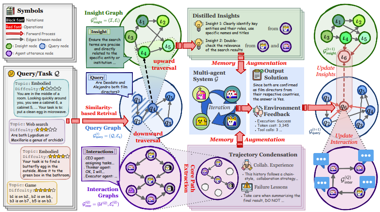

# G-Memory: Tracing Hierarchical Memory for Multi-Agent Systems


## 👋 Introduction
This repo is the official implementation of [***G-Memory: Tracing Hierarchical Memory for Multi-Agent Systems***](https://arxiv.org/abs/2506.07398).

Our method, G-Memory, empowers multi-agent systems with a hierarchical memory architecture that continuously evolves through interaction. Inspired by organizational memory theory, G-Memory captures generalizable insights and agent-specific collaboration trajectories across tasks using a structured graph-based design. When a new task arrives, it retrieves relevant past experiences and distilled knowledge to inform agent behavior and coordination. As agents complete tasks, G-Memory updates its memory hierarchy with new interactions, enabling teams to adapt and improve over time.



## 🌎 Setup
```
conda create -n GMemory python=3.12
conda activate GMemory
pip install -r requirements.txt
```

## 🚀 Quick Start

### 🌳 Environments
Please download the ALFWorld, PDDL, FEVER datasets and place it in the data folder.
- 🏠 [ALFWorld](https://github.com/alfworld/alfworld)
- 🐹 [PDDL](https://github.com/hkust-nlp/AgentBoard)
- 🌡️ [FEVER](https://github.com/awslabs/fever)

The file structure should be organized as follows:
```
data
└── alfworld
    └── alfworld_tasks_suffix.json
└── pddl
    └── test.json
└── fever
    └── fever_dev.jsonl
```

### 🔑 Add API keys in template.env and change its name to .env
```
OPENAI_API_BASE = "" # the BASE_URL of OpenAI LLM backend
OPENAI_API_KEY = ""  # for OpenAI LLM backend
```

### 🔎 Choices Overview
- Available memories: ***Empty, ChatDev, MetaGPT, Voyager, Generative, MemoryBank, G-Memory***
- Available MAS: ***AutoGen, DyLAN, MacNet***

### ▶️ How to Run
- Option 1: Run with Shell Script. Simply execute the following script:
    ```
    ./run_mas.sh
    ```
- Option 2: Run with Python Command. You can also launch specific tasks via command-line:
    ```
    python tasks/run.py --task alfworld --reasoning io --mas_memory g-memory --max_trials 30 --mas_type autogen --model <your model here>
    python tasks/run.py --task pddl --reasoning io --mas_memory g-memory --max_trials 30 --mas_type autogen --model <your model here>
    python tasks/run.py --task fever --reasoning io --mas_memory g-memory --mas_trials 15 --mas_type autogen --model <your model here>
    ```

## 🫡 Citation
If you find this repository helpful, a citation to our paper would be greatly appreciated:
```
@article{zhang2025g-memory,
  title={G-Memory: Tracing Hierarchical Memory for Multi-Agent Systems},
  author={Zhang, Guibin and Fu, Muxin and Wan, Guancheng and Yu, Miao and Wang, Kun and Yan, Shuicheng},
  journal={arXiv preprint arXiv:2506.07398},
  year={2025}
}
```

## 🙏 Acknowledgement
- We sincerely thank [ExpeL](https://github.com/LeapLabTHU/ExpeL) for providing their prompt designs.
- We also extend our heartfelt thanks to [AgentSquare](https://github.com/tsinghua-fib-lab/AgentSquare) for their dataset environments and baseline implementations.

